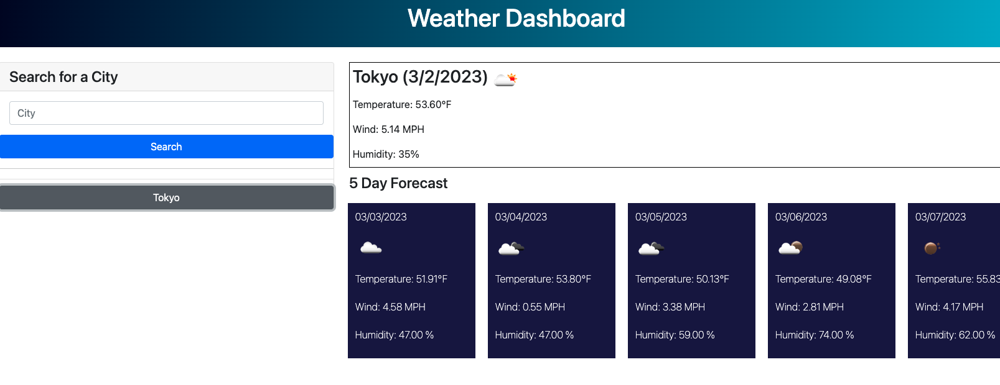

# weather-dashboard

##Description
The purpose of this class homework was to implement a real time weather dashboard. Users would come in and enter in a city to see the current weather forcast of temperature, humidity, and windspeed. The five day forecast for said city will also be displayed.  Previous entries will be saved through Local Storage and be displayed as an inactive button underneath the Search icon. 

##Technologies
HTML, CSS, Vanilla JavaScript, OpenWeather API, DayJS API

[Link](https://hiclarence.github.io/weather-dashboard/)